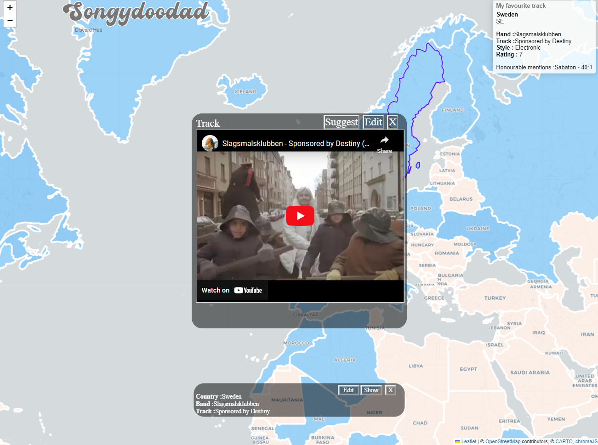

#songmap
Map of the world with my favourite tracks. You can customise it with your own map, and it stores it in local browser

My instance of the site is running at:
https://songydoodad.superpomme.co.uk/

The settings are found by clicking "Songydoodad" at the top, as seen in my super professional image below

